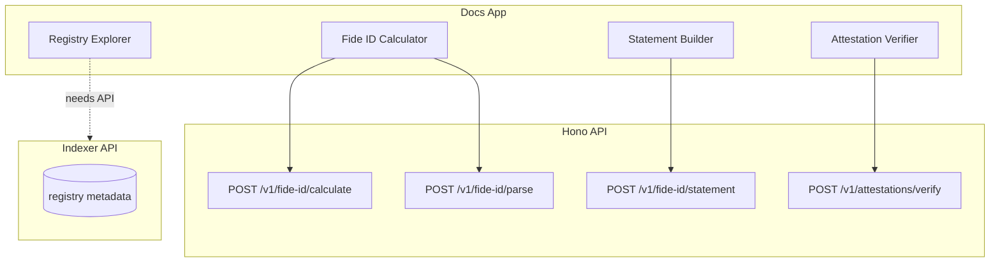

# FCP API Endpoints and Tools Implementation Plan

## Architecture Overview

---

## Phase 1: Fide ID Calculate + Parse + Fide ID Calculator Tool

### API Endpoints

**1. POST /v1/fide-id/calculate**

- **Input**: `{ entityType, sourceType, rawIdentifier }` (reuse pattern from [identity.ts](apps/api/src/schemas/identity.ts))
- **Output**: `{ fideId: string }`
- **Logic**: Call `calculateFideId` from `@fide.work/fcp`
- **Location**: New route file `apps/api/src/routes/fide-id.ts`

**2. POST /v1/fide-id/parse**

- **Input**: `{ fideId: string }`
- **Output**: `{ entityType, sourceType, fingerprint, typeChar, sourceChar }`
- **Logic**: Call `parseFideId` from `@fide.work/fcp`
- **Location**: Same `fide-id.ts` route file

### Tool: Fide ID Calculator

- **Component**: `apps/docs/src/components/tools/fide-id-calculator.tsx`
- **MDX**: `apps/docs/content/tools/fide-id-calculator.mdx`
- **UI**: Two modes (mirror Identity Inspector pattern):
  - **Calculate**: entity type + source type + raw identifier → Fide ID (calls `/v1/fide-id/calculate`)
  - **Parse**: full Fide ID → entity type, source type, fingerprint (calls `/v1/fide-id/parse`)
- **Reuse**: Combobox for entity/source types, Tabs layout from [identity-inspector.tsx](apps/docs/src/components/tools/identity-inspector.tsx)

---

## Phase 2: Statement Fide ID + Statement Builder Tool

### API Endpoint

**POST /v1/fide-id/statement**

- **Input**: `{ subjectFideId, predicateFideId, objectFideId }`
- **Output**: `{ statementFideId: string }`
- **Logic**: Call `calculateStatementFideId` from `@fide.work/fcp`
- **Location**: Add to `apps/api/src/routes/fide-id.ts`

### Tool: Statement Builder

- **Component**: `apps/docs/src/components/tools/statement-builder.tsx`
- **MDX**: `apps/docs/content/tools/statement-builder.mdx`
- **UI**: Three inputs (S, P, O) as Fide IDs or raw identifiers; optional expand for predicates (e.g. `schema:name` → `calculateFideId("CreativeWork","CreativeWork", expanded)`)
- **Output**: Statement Fide ID; link to Identity Inspector for resolution
- **Optional**: Use `expandPredicateIdentifier` + `getPredicateFideId` for predicate shortcuts

---

## Phase 3: Attestation Verify + Attestation Verifier Tool

### API Endpoint

**POST /v1/attestations/verify**

- **Input**: `{ statementFideId, proof, attestationData, method, publicKeyOrAddress }`
- **Logic**: Call `verifyAttestation` from [packages/fcp/src/attestation/verify.ts](packages/fcp/src/attestation/verify.ts)
- **Ed25519**: Accept base64 or hex-encoded raw public key; import to `CryptoKey` on server via `crypto.subtle.importKey`
- **EIP-712/EIP-191**: Accept address string as-is
- **Output**: `{ valid: boolean }`
- **Location**: Add to `apps/api/src/routes/attestations.ts`

### Tool: Attestation Verifier

- **Component**: `apps/docs/src/components/tools/attestation-verifier.tsx`
- **MDX**: `apps/docs/content/tools/attestation-verifier.mdx`
- **UI**: Form for statement Fide ID, Merkle proof (JSON array), attestation data (JSON), method (ed25519/eip712/eip191), public key/address
- **Output**: Valid/invalid result with clear feedback

---

## Phase 4: Registry Explorer (Deferred)

- **Purpose**: Browse attestation registries–list JSONL files by path/date, inspect attestation contents, optionally link to Identity Inspector for resolution.
- **Blocker**: Requires an API that exposes registry metadata (e.g. indexer or a simple registry listing endpoint). Defer until that API exists.
- **Placeholder**: Keep in plan; implement when indexer/registry API is available.

---

## Phase 5 (Optional): POST /v1/statements

- **Input**: `{ statements: Array<{ subject, predicate, object }> }` with raw identifiers
- **Output**: `{ statementFideIds: string[] }`
- **Logic**: Use `createStatement`/`buildStatementBatch` from `@fide.work/fcp`
- **Lower priority**; useful for batch statement creation without full attestation flow

---

## Implementation Order

| Phase | Endpoints                                    | Tool                 | Effort                        |
| ----- | -------------------------------------------- | -------------------- | ----------------------------- |
| 1     | `/v1/fide-id/calculate`, `/v1/fide-id/parse` | Fide ID Calculator   | Low                           |
| 2     | `/v1/fide-id/statement`                      | Statement Builder    | Low                           |
| 3     | `/v1/attestations/verify`                    | Attestation Verifier | Medium (Ed25519 key handling) |
| 4     | —                                            | Registry Explorer    | Deferred (needs indexer API)  |
| 5     | `/v1/statements`                             | —                    | Low (optional)                |

---

## File Changes Summary

### New files

- `apps/api/src/routes/fide-id.ts` – calculate, parse, statement endpoints
- `apps/api/src/schemas/fide-id.ts` – Zod schemas for fide-id routes
- `apps/docs/src/components/tools/fide-id-calculator.tsx`
- `apps/docs/content/tools/fide-id-calculator.mdx`
- `apps/docs/src/components/tools/statement-builder.tsx`
- `apps/docs/content/tools/statement-builder.mdx`
- `apps/docs/src/components/tools/attestation-verifier.tsx`
- `apps/docs/content/tools/attestation-verifier.mdx`

### Modified files

- `apps/api/src/app.ts` – mount fide-id route
- `apps/docs/src/mdx-components.tsx` – register new tool components
- `apps/docs/content/tools/meta.json` – add sidebar entries
- `apps/api/src/routes/attestations.ts` – add verify route

---

## Resolved Decisions

- **Ed25519**: Support base64 or hex public key; import to `CryptoKey` on server.
- **Schema Explorer**: Dropped. Schema is already documented; an interactive "explorer" adds little value.
- **Registry Explorer**: Deferred until indexer/registry API exists. Would browse JSONL files and inspect attestations.

