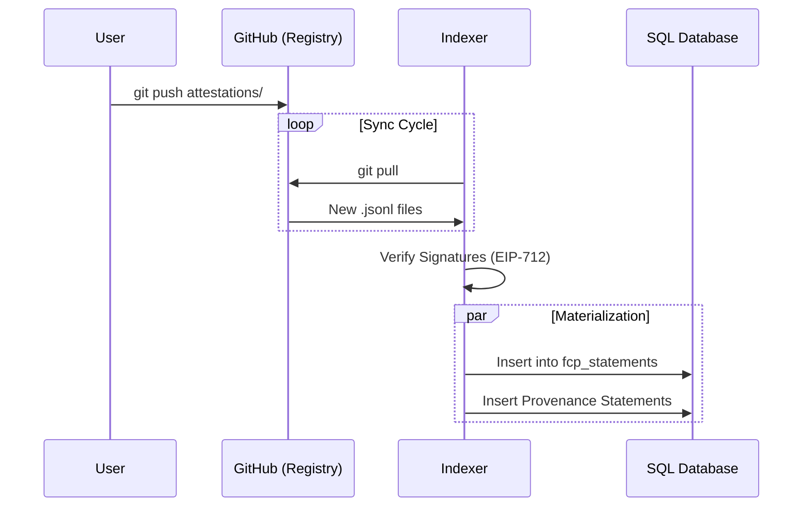

import { Step, Steps } from 'fumadocs-ui/components/steps';
import { Callout } from 'fumadocs-ui/components/callout';
import { Accordions, Accordion } from 'fumadocs-ui/components/accordion';
import { TypeTable } from 'fumadocs-ui/components/type-table';

**Indexing** is the Ingestion Path of the Fide Context Protocol.
This page covers how broadcast [**Signed Statements**](/docs/attesting) are discovered, validated, and materialized into a queryable graph.
**Indexing is optional infrastructure** — applications can implement their own indexing, use shared indexers, or query statements directly.

<Callout type="info" title="SDK Support">
The SDK provides verification utilities for indexers. See [Indexing](/docs/sdks-legacy/js/indexing) in the SDK documentation for available functions.
</Callout>

<Callout type="info">
FCP specifies **what** must be validated (signatures, timestamps, strict violations) but not **how** to store or query the data. Storage technology is an implementation choice. This reference implementation uses a **Pure Graph Architecture**:

- **2 Core Tables**: `fcp_raw_identifiers` (fingerprint↔identifier mapping), `fcp_statements` (all graph edges)
- **All relationships are Statements** via PROV-O and W3C Security patterns (`prov:wasGeneratedBy`, `prov:wasAssociatedWith`, `sec:controller`)
- **Type-Safe Enums**: PostgreSQL enum types for entity types, source types, and predicate types
</Callout>

---

## The Ingestion Pipeline [#ingestion]

Indexers discover Fide attestation registries through topic scanning or manual configuration (see **[Broadcasting: Discovery](/docs/broadcasting#discovery)**).

<Callout type="info" title="Indexing Metadata">
Indexers often attach extra metadata that is not part of the core statement graph.

- `indexed_at`: when this indexer first observed an attestation in a registry
- `anchored_at` (optional): when the attestation was first verifiably included in an anchored batch (external sequencing layer)
</Callout>

### Discovery Flow [#discovery-flow]

<Steps>
<Step>
**Scan**: Query GitHub API for topic <a href="/docs/broadcasting#discovery"><code>fide-attestation-registry</code></a>
</Step>

<Step>
**Register**: Add discovered repo URLs to your sync list (or equivalent mechanism in your indexing pipeline)
</Step>

<Step>
**Ingest**: Start the indexing pipeline to begin validating and materializing attestations from discovered registries
</Step>
</Steps>

<Accordions>
<Accordion title="Sync Flow" id="sync-flow">
<Steps>
<Step>
**Bootstrap**: `git clone <repo_url>` — Initial sync of a Fide attestation registry. Parse all existing `.jsonl` files in `attestations/YYYY/MM/DD/` structure.
</Step>

<Step>
**Update**: `git pull origin main` — Incremental sync. Parse only new files since last sync.
</Step>

<Step>
**Verify**: Validate [EIP-712](https://eips.ethereum.org/EIPS/eip-712) signatures, check **Strict Violations**, and materialize valid attestations.
</Step>
</Steps>

</Accordion>
</Accordions>

---

## Suggested Indexer Architecture [#architecture] [#suggested-architecture] [#architecture]

This reference implementation uses a relational database (PostgreSQL via [Supabase](https://supabase.com)) with two core tables and supporting views.

### Tables [#tables]

### **`fcp_raw_identifiers`** [#identifiers]

<TypeTable
  type={{
    identifier_fingerprint: {
      description: 'Fide ID fingerprint',
      type: 'char(38)',
      required: true,
    },
    raw_identifier: {
      description: 'Human-readable identifier (e.g., "x.com/alice", "schema:worksFor")',
      type: 'text',
      required: true,
    },
  }}
/>

Fingerprint ↔ identifier lookup table.

---

### **`fcp_statements`** [#statements]

<TypeTable
  type={{
    statement_fingerprint: {
      description: 'Statement fingerprint (did:fide:0x00... implicit: Statement identified by Statement)',
      type: 'char(38)',
      required: true,
    },
    subject_type: {
      description: 'Subject entity type (1 char: 1=Person, 2=Organization, etc.)',
      type: 'char(1)',
      required: true,
    },
    subject_source_type: {
      description: 'Subject source type (1 char: 0=Statement, 5=Product, 6=CreativeWork, 8=CryptographicAccount)',
      type: 'char(1)',
      required: true,
    },
    subject_fingerprint: {
      description: 'Subject fingerprint (FK → fcp_raw_identifiers.identifier_fingerprint)',
      type: 'char(38)',
      required: true,
    },
    predicate_type: {
        description: 'Predicate type (1 char: 6=Relationship, e=Evaluation)',
        type: 'char(1)',
        required: true,
    },
    predicate_source_type: {
        description: 'Predicate source type (1 char)',
        type: 'char(1)',
        required: true,
    },
    predicate_fingerprint: {
      description: 'Predicate fingerprint (did:fide:0x66... implicit, FK → fcp_raw_identifiers.identifier_fingerprint)',
      type: 'char(38)',
      required: true,
    },
    object_type: {
      description: 'Object entity type (1 char)',
      type: 'char(1)',
      required: true,
    },
    object_source_type: {
      description: 'Object source type (1 char)',
      type: 'char(1)',
      required: true,
    },
    object_fingerprint: {
      description: 'Object fingerprint (FK → fcp_raw_identifiers.identifier_fingerprint)',
      type: 'char(38)',
      required: true,
    },
  }}
/>

Core triple store: all facts as subject-predicate-object tuples.

---

## Query Patterns [#query-patterns] [#indexer-query-patterns] [#query-patterns]

Query patterns extract specific patterns from <a href="/docs/indexing#statements">`fcp_statements`</a> to provide queryable subsets of the graph (see **[Querying](/docs/querying)** for application-level query logic). These are implemented via the materialized view below and TypeScript service layers for complex patterns.

### Identity Resolution [#identity-resolution]

Fide IDs (`did:fide:0x...`) are deterministic but fragmented. A single person may have multiple Fide IDs (one for Twitter, one for GitHub, one for a wallet).

Indexers must resolve these fragments into a single, cohesive entity.

<Callout type="info" title="Implementation Guides">
For detailed algorithms and SQL patterns, see the **[Identity Resolution Guides](/docs/guides/identity-resolution)**.
*   **[Min Fide ID](/docs/guides/identity-resolution/min)**: The decentralized default.
*   **[Genesis Statement Fide ID](/docs/guides/identity-resolution/genesis-statement)**: For time-stable identity.
</Callout>

### Materialized View: Statements with Resolved Identifiers [#resolved-statements]

Pre-resolves identifier aliases to canonical primaries and materializes human-readable identifier strings. **Excludes `owl:sameAs` statements** to prevent circular resolution logic.

<Accordions>
<Accordion title="Why This View Exists" id="resolved-view-rationale">

The standard 2-phase resolution pattern (fetch fingerprints → batch resolve to identifiers) requires 2-5 database calls per query. This materialized view collapses that into a single join:

- **Performance**: 40-80% reduction in database calls
- **Identity Resolution**: Querying any identifier in a cluster returns statements about the canonical primary (MIN fingerprint)
- **Provenance**: All `*_original` columns preserve the exact statement as it was created, enabling full traceability
- **Type Inheritance**: Resolved type and source type are inherited from the canonical primary entity
- **Accessibility**: Original fingerprints available via `statement_fingerprint` join to `fcp_statements` if needed

</Accordion>
</Accordions>

<TypeTable
  type={{
    statement_fingerprint: {
      description: 'Statement fingerprint (FK → fcp_statements.statement_fingerprint)',
      type: 'char(38)',
      required: true,
    },
    subject_type_original: {
      description: 'Original subject entity type (before resolution)',
      type: 'char(1)',
      required: true,
    },
    subject_type: {
      description: 'Resolved subject entity type (from canonical primary)',
      type: 'char(1)',
      required: true,
    },
    subject_source_type_original: {
      description: 'Original subject source type (before resolution)',
      type: 'char(1)',
      required: true,
    },
    subject_source_type: {
      description: 'Resolved subject source type (from canonical primary)',
      type: 'char(1)',
      required: true,
    },
    subject_fingerprint_original: {
      description: 'Original subject fingerprint (before resolution)',
      type: 'char(38)',
      required: true,
    },
    subject_fingerprint: {
      description: 'Resolved subject fingerprint (canonical primary)',
      type: 'char(38)',
      required: true,
    },
    subject_raw_identifier_original: {
      description: 'Original subject identifier (e.g., "https://x.com/alice")',
      type: 'text',
      required: true,
    },
    subject_raw_identifier: {
      description: 'Resolved subject identifier (e.g., "https://github.com/alice")',
      type: 'text',
      required: true,
    },
    predicate_type: {
      description: 'Predicate type (6=CreativeWork, e=EvaluationMethod)',
      type: 'char(1)',
      required: true,
    },
    predicate_source_type: {
      description: 'Predicate source type (always 5=Product)',
      type: 'char(1)',
      required: true,
    },
    predicate_fingerprint: {
      description: 'Predicate fingerprint (FK → fcp_raw_identifiers.identifier_fingerprint)',
      type: 'char(38)',
      required: true,
    },
    predicate_raw_identifier: {
      description: 'Predicate identifier (e.g., "schema:name", "owl:sameAs")',
      type: 'text',
      required: true,
    },
    object_type_original: {
      description: 'Original object entity type (before resolution)',
      type: 'char(1)',
      required: true,
    },
    object_type: {
      description: 'Resolved object entity type (from canonical primary)',
      type: 'char(1)',
      required: true,
    },
    object_source_type_original: {
      description: 'Original object source type (before resolution)',
      type: 'char(1)',
      required: true,
    },
    object_source_type: {
      description: 'Resolved object source type (from canonical primary)',
      type: 'char(1)',
      required: true,
    },
    object_fingerprint_original: {
      description: 'Original object fingerprint (before resolution)',
      type: 'char(38)',
      required: true,
    },
    object_fingerprint: {
      description: 'Resolved object fingerprint (canonical primary)',
      type: 'char(38)',
      required: true,
    },
    object_raw_identifier_original: {
      description: 'Original object identifier (before resolution)',
      type: 'text',
      required: true,
    },
    object_raw_identifier: {
      description: 'Resolved object identifier (from canonical primary)',
      type: 'text',
      required: true,
    },
  }}
/>

---

<Accordions>
<Accordion title="The Indexer Bridge" id="indexer-bridge">

The Indexer serves as the critical performance bridge that transforms FCP's distributed architecture into a practical, queryable system:

| Layer | Characteristics |
|-------|-----------------|
| **Fide Attestation Registries (Git)** | Distributed, versioned, high-latency source of truth |
| **Indexer Bridge** | Ingests, validates, materializes |
| **Query Tier (Postgres/etc)** | Low-latency, complex queries, real-time apps |

### Why This Matters [#why-indexer-bridge]

Without this bridge, applications face an impossible choice:
- Query GitHub directly → Poor performance
- Build their own indexing → Redundant work
- Skip indexing → Limited to simple use cases

The indexer enables: **distributed verifiability** (broadcast) + **practical performance** (optimized queries).

</Accordion>

<Accordion title="Eventual Consistency" id="eventual-consistency">

FCP is **eventually consistent**. There is no single canonical indexer.

**What This Means:**
- Different indexers may have slightly different data at any moment
- Attestations propagate through Git push → indexer sync cycles
- Timing differences are expected and normal

**Application Guidance:**
- Do not assume instant propagation after broadcasting
- For critical queries, poll multiple indexers or wait for confirmation
- Design UIs to handle "pending" states gracefully

**Why This Is OK:**
- Attestations are immutable once signed — they don't change during propagation
- Signatures are deterministic — same attestation always verifies the same way
- Evaluations can be made by any indexer with the data

</Accordion>
</Accordions>
