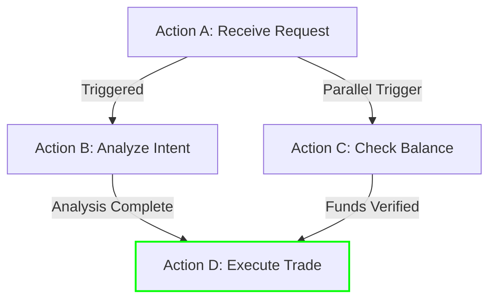

import { Callout } from 'fumadocs-ui/components/callout';
import { TypeTable } from 'fumadocs-ui/components/type-table';
import { Accordion, Accordions } from 'fumadocs-ui/components/accordion';

Actions use the unified [**FCP Statement Schema**](/docs/schema). The **Action** is an Entity (Type `Event` / `did:fide:0x4...`); statements describe it.

<TypeTable
  type={{
    subject: { description: 'Action Entity (Event, did:fide:0x4...)', type: 'Fide ID' },
    predicate: { description: 'Relationship (0x65 or 0xe5) — e.g. schema:actionStatus, schema:agent', type: 'Fide ID' },
    object: { description: 'Value or target entity', type: 'Fide ID' },
  }}
/>

## Predicate Mapping [#predicate-mapping]

Use the following predicates within the unified [**Schema**](/docs/schema):

### Core FCP Predicates [#fcp-predicates]

| Predicate | Description | Example |
|-----------|-------------|---------|
| `schema:rationale` | Chain-of-thought or explanation | Rationale string (hashed via <code><a href="/docs/identifiers#calculate">calculateFideId</a>()</code>) |

### Common Schema.org Predicates [#schema-predicates]

For linking actions to agents or sessions, use the standard [**Action Relationships**](/docs/schema/relationships#actions-workflow-predicates) (`schema:agent`, `schema:isPartOf`, `prov:wasInformedBy`).

| Predicate | Description | Example |
|-----------|-------------|---------|
| `schema:actionStatus` | Status of the action | `"schema:CompletedActionStatus"`, `"schema:FailedActionStatus"` |
| `schema:startTime` | When the action started | ISO 8601 UTC timestamp |
| `schema:endTime` | When the action ended | ISO 8601 UTC timestamp |
| `schema:object` | Input parameters or context | JSON string (hashed via <code><a href="/docs/identifiers#calculate">calculateFideId</a>()</code>) |
| `schema:result` | Output result or response | JSON string (hashed via <code><a href="/docs/identifiers#calculate">calculateFideId</a>()</code>) |

<Accordions>
<Accordion title="Example: Simple Action Step">

```typescript
// 1. Define the Action Entity (Type 0x4 = Event)
// Use a stable identifier string for the execution/run (transport-agnostic)
const actionFideId = await calculateFideId('Event', 'Product', 'otel:run:unique-execution-id-123');

// 2. Statements about this Action
[
  {
    subjectFideId: actionFideId,
    predicateRawIdentifier: "schema:type",
    objectRawIdentifier: "schema:Action"
  },
  {
    subjectFideId: actionFideId,
    predicateRawIdentifier: "schema:agent",
    objectFideId: "did:fide:0xAgentFideId..."
  },
  {
    subjectFideId: actionFideId,
    predicateRawIdentifier: "schema:actionStatus",
    objectRawIdentifier: "schema:CompletedActionStatus"
  },
  {
    subjectFideId: actionFideId,
    predicateRawIdentifier: "schema:startTime",
    objectRawIdentifier: "2026-01-19T12:00:00Z"
  },
  {
    subjectFideId: actionFideId,
    predicateRawIdentifier: "schema:object",
    objectRawIdentifier: '{"tool": "calculate_tax", "amount": 100}'
  },
  {
    subjectFideId: actionFideId,
    predicateRawIdentifier: "schema:result",
    objectRawIdentifier: '{"result": 15}'
  },
  {
    subjectFideId: actionFideId,
    predicateRawIdentifier: "schema:rationale",
    objectRawIdentifier: "Calculated 15% tax on $100"
  }
]
```

</Accordion>
</Accordions>


## Workflow Sessions [#workflow-sessions]

A **Session** represents a single execution context (e.g., a user request, a specific task run, or a "thread"). Actions are grouped into sessions to keep related steps together.

Use the standard [**grouping predicate**](/docs/schema/relationships#actions-workflow-predicates) (`schema:isPartOf`) to link steps to their container.

### Implementation Pattern

1.  **Create a Session Entity**: Usually type `Event` (`did:fide:0x4...`) representing the parent process.
2.  **Link Actions**: Each Action Step issues a statement pointing to it.

```typescript
// 1. The Session Entity (The Container)
const sessionID = "did:fide:0xSessionID..."; // e.g., Derived from "Execution-Run-123"

// 2. The Action Step (The Part)
const actionID = "did:fide:0xActionID...";

// 3. Link them
{
  subjectFideId: actionID,                          // The Step
  predicateRawIdentifier: "schema:isPartOf",
  objectFideId: sessionID                           // The Session
}
```

This allows indexers to query the `sessionID` and retrieve all linked steps (incoming `isPartOf` edges) to reconstruct the full timeline.

## DAG Structure [#dag] [#dag-structure]

For parallel execution traces, use relationship statements to link actions:

<Accordions>
<Accordion title="Example: DAG Statements">

```typescript
// Define Action A (Parent)
const actionAFideId = "did:fide:0xActionAFideId...";

// Define Action B (Child, parallel step 1)
const actionBFideId = "did:fide:0xActionBFideId...";

// Create relationship: Action B follows Action A
[
  {
    subjectFideId: actionBFideId,
    predicateRawIdentifier: "prov:wasInformedBy",
    objectFideId: actionAFideId
  },
  // ... other statements about Action B (agent, status, etc.)
]

// Define Action C (Child, parallel step 2)
const actionCFideId = "did:fide:0xActionCFideId...";

// Create relationship: Action C ALSO follows Action A
[
  {
    subjectFideId: actionCFideId,
    predicateRawIdentifier: "prov:wasInformedBy",
    objectFideId: actionAFideId
  }
]
```

</Accordion>
</Accordions>

**Why DAG over linear indexing?**
- **Parallelism**: If Step A triggers both B and C simultaneously, both can reference A
- **Traceability**: Reconstruct exact execution tree without race conditions
- **Git-like History**: Each step cryptographically chained to its predecessor



<Accordions>
<Accordion title="OpenTelemetry Integration">

FCP aligns with OpenTelemetry concepts:
- **Session** ≈ **Trace** (The full request lifecycle)
- **Step** ≈ **Span** (The basic building block of work)

Developers using OpenTelemetry can add a lightweight processor to automatically convert spans into signed Action Entities and Statements.

**Benefits:**
- **Zero-Touch Instrumentation**: Convert existing logs into verifiable statements
- **Polyglot Support**: Works with Python, JS, Go, Rust, Java
- **Strict Typing**: OTel attributes map to FCP predicates automatically

</Accordion>

<Accordion title="Privacy Considerations">

**Input/Output fields may contain sensitive data.** Consider:
- **Redaction**: Strip PII before signing
- **Encryption**: Store sensitive data off-chain, reference via URI
- **Access Control**: Use workspace-scoped registries for private workflows

</Accordion>
</Accordions>
