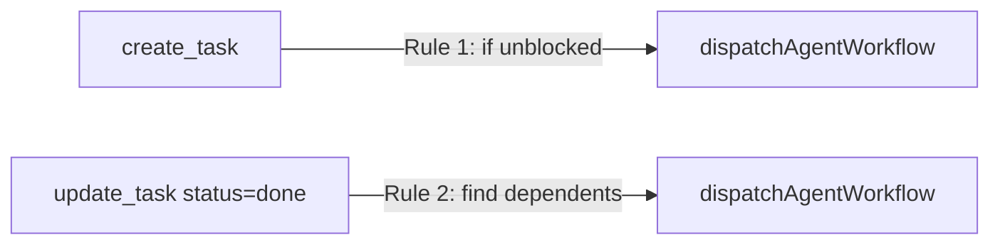
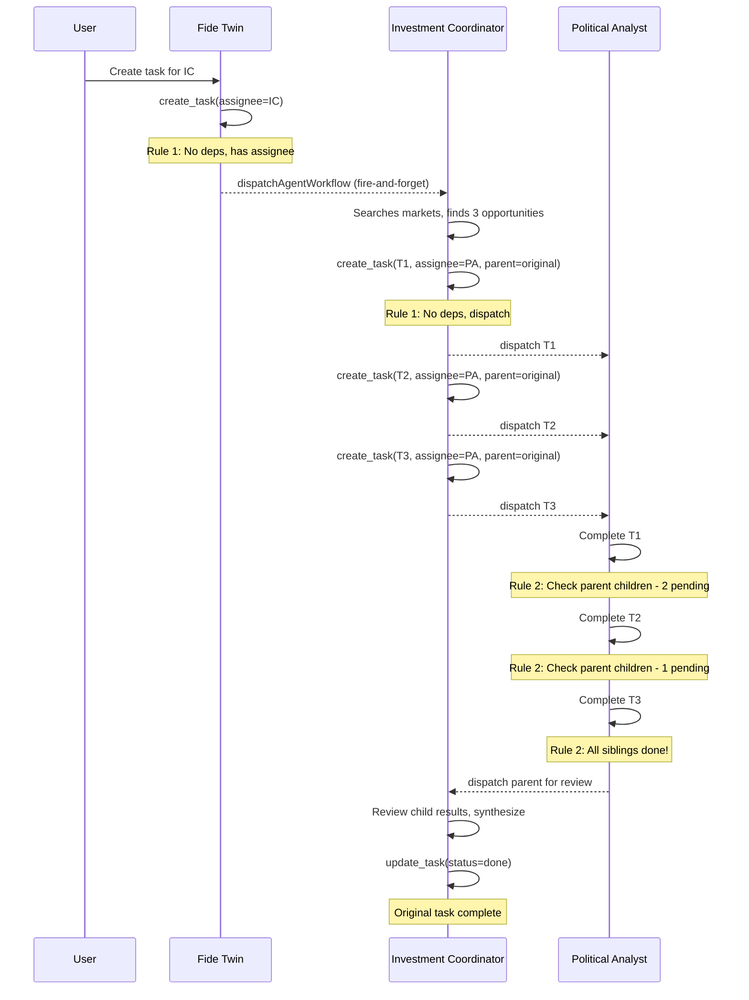

**Purpose**: Define the "Nervous System" of Fide—how the system detects work (Tasks) and wakes up the correct "Brain" (Agents) to do it.

**Type**: **System Dispatch** - Event-driven, automatic agent wake-up when tasks are assigned (not user-created workflows)

**Status**: ✅ Complete — Simple inline dispatch with two rules

**Related**: 
- See `TOOL-WORKFLOWS-STRATEGY.md` for user-created tool workflows (visual builder, on-demand execution)
- See `agent-context/TOOL-PACK-HIERARCHY-STRATEGY.md` for tool pack configuration (which tools agents can access)

---

## 1. The Problem: "The Silent Database"
Currently, Fide is a passive system.
- A user creates a Task: `INSERT INTO tasks ...`
- The Task sits there.
- The "Fide Twin" (Service Account) does not know it has work until a human manually chats with it.

**The Goal**: Move from **Passive Tracking** to **Active Orchestration**. When a task is assigned to an agent, the agent should immediately "wake up," acknowledge the task, and begin execution.

---

## 2. Architecture Overview

The **Dispatch Engine** uses two simple, inline rules:



**Rule 1 - Dispatch on Creation:**
- In `createTask.ts`: After creating task, if `assigned_to_member_id` is set and task has no incomplete dependencies, call `dispatchAgentWorkflow()` immediately

**Rule 2 - Dispatch Dependents on Completion:**
- In `updateTask.ts`: After marking task `done`/`cancelled`:
  - Dispatch tasks that were blocked by this one (if now unblocked)
  - Dispatch parent task assignee for review (if all children complete and parent is still pending)

---

## 3. Example Flow

User says to Fide Twin:
> "Create a task for the Investment Coordinator Agent: Find 3 alpha opportunities in political prediction markets this week."



**Key dispatch points:**
1. Fide Twin creates task for IC → IC dispatched immediately (Rule 1)
2. IC creates 3 child tasks → Each dispatched immediately (Rule 1)
3. PA completes last child → IC dispatched for review (Rule 2 - parent review)

---

## 4. Implementation Details

### 4.1 Task Creation & Dispatch (Rule 1)
- **Where**: `fide/lib/local-tools/tasks/createTask.ts` → `executeCreateTask()`
- **Flow**:
  1) Agent calls `create_task` tool
  2) Task created in database
  3) If `blockedByTaskId` provided, create dependency record
  4) If task has assignee AND no incomplete dependencies → dispatch immediately (fire-and-forget)
  5) If task has blocking dependencies → skip dispatch (task stays pending until unblocked)

```typescript
// After task is created successfully
if (task.assigned_to_member_id) {
    const deps = await getIncompleteTaskDependencies(client, task.id);
    if (deps.length === 0) {
        // Fire-and-forget dispatch
        dispatchAgentWorkflow(client, task.id, assigneeUserId, task.team_id)
            .catch(err => logger.warn('Dispatch failed', { taskId: task.id }));
    }
}
```

### 4.2 Task Completion & Unblock (Rule 2)
- **Where**: `fide/lib/local-tools/tasks/updateTask.ts` → `executeUpdateTask()`
- **Trigger**: Task status changes to `done` or `cancelled`
- **Auto-Completion**: If all todos are completed/skipped and no explicit status provided, task auto-completes
- **Flow**:
  1) Apply todo operations if provided
  2) Check if all todos complete → auto-set status to done
  3) Task marked complete
  4) Find tasks that depended on this one (`getTasksDependingOn`)
  5) For each dependent: if now fully unblocked and assigned → dispatch
  6) If task has `parent_task_id`: check if all siblings complete
  7) If all siblings complete AND parent is still `pending` or `in_progress` → dispatch parent assignee for review

```typescript
// After task is marked done/cancelled
if (isBecomingComplete) {
    // Dispatch tasks that were blocked by this one
    const dependentTasks = await getTasksDependingOn(client, task.id);
    for (const depTask of dependentTasks) {
        if (depTask.status === 'pending' && depTask.assigned_to_member_id) {
            const remainingDeps = await getIncompleteTaskDependencies(client, depTask.id);
            if (remainingDeps.length === 0) {
                dispatchAgentWorkflow(client, depTask.id, ...)
                    .catch(err => logger.warn('Dispatch failed', { taskId: depTask.id }));
            }
        }
    }
    
    // Check if parent task needs review (all children complete)
    if (task.parent_task_id) {
        const { allComplete } = await checkChildTasksCompletion(client, task.parent_task_id);
        if (allComplete) {
            const parent = await getParentTaskForReview(client, task.parent_task_id);
            // Guard: Only dispatch if parent is still pending or in_progress
            if (parent?.assigned_to_member_id && (parent.status === 'pending' || parent.status === 'in_progress')) {
                dispatchAgentWorkflow(client, parent.id, ...)
                    .catch(err => logger.warn('Parent review dispatch failed', { parentId: parent.id }));
            }
        }
    }
}
```

### 4.3 Agent Execution
- **Where**: `fide/services/dispatch/dispatch-service.ts` → `dispatchAgentWorkflow()`
- **Input**: `client`, `taskId`, `userId` (assignee), `teamId`, optional `message`
- **Execution**:
  1) Validates task exists and is not done/cancelled
  2) Builds task introduction message (or uses provided message)
  3) Calls `executeAgentMessage` directly (fire-and-forget)
  4) Agent JWT generated internally, RLS enforced

### 4.4 Order Independence

The simplified model is **order-independent** because both rules check current state:

**Scenario A: Dependency created before blocker completes**
1. T-review created with `blockedByTaskId: T-work`
2. Rule 1 checks: T-work incomplete → T-review NOT dispatched
3. T-work marked done
4. Rule 2 finds T-review as dependent → T-review dispatched

**Scenario B: Dependency created after blocker completes**
1. T-work created and dispatched
2. T-work marked done (no dependents exist yet)
3. T-review created with `blockedByTaskId: T-work`
4. Rule 1 checks: T-work is done (complete) → T-review dispatched immediately

Both scenarios result in correct dispatch.

---

## 5. Task Dependencies & Blocking

Tasks can be blocked by other tasks using the `task_dependencies` table.

**Dependency Creation**:
- **Parameter**: `blockedByTaskId` in `create_task` tool
- Creates a record in `task_dependencies(task_id, depends_on_task_id)`

**Approval Workflow Pattern**:
```
Agent creates:
├─ T-approval (assigned: Manager) - "Approve work plan"
└─ T-work (assigned: Worker, blockedByTaskId: T-approval)

Flow:
1. T-approval dispatches to Manager (Rule 1)
2. T-work NOT dispatched (blocked)
3. Manager marks T-approval done
4. T-work automatically dispatched (Rule 2)
```

---

## 6. Task Todos & Derived Status

Tasks have structured todos stored as YAML frontmatter in their description. **Task status is fully derived from todos** - agents do not set status directly (except for `cancelled`).

**Status Derivation**:
| Todo State | Task Status |
|------------|-------------|
| All `pending` | `pending` |
| Any `in_progress` | `in_progress` |
| All `completed`/`skipped` | `done` |

The only status that can be set explicitly is `cancelled` (to abandon a task).

**YAML Frontmatter Format** (stored in task description):
```markdown
---
todos:
  - id: complete-work
    content: Complete the work described above
    status: pending
  - id: document-results
    content: Document results in this task description
    status: pending
---

Task description body goes here...
```

**Todo Schema**:
```typescript
interface Todo {
    id: string;           // Human-readable slug (e.g., "scan-markets")
    content: string;      // Todo description
    status: TodoStatus;   // 'pending' | 'in_progress' | 'completed' | 'skipped'
}
```

**Default Todos** (added automatically to new tasks):
- `complete-work`: "Complete the work described above"
- `document-results`: "Document results in this task description"

**Updating Todos** (via `update_task` tool):
```typescript
// Update status of existing todo
update_task({
    taskId: "...",
    todos: [{ id: "complete-work", status: "completed" }]
})

// Add new todo
update_task({
    taskId: "...",
    todos: [{ id: "new-step", content: "New step description", status: "pending" }]
})

// Replace all todos (merge: false)
update_task({
    taskId: "...",
    todos: [{ id: "only-step", content: "Only step", status: "pending" }],
    merge: false
})

// Cancel a task (only explicit status allowed)
update_task({
    taskId: "...",
    status: "cancelled"
})
```

**Agent Workflow**:
1. Agent starts work → marks first todo `in_progress` → task becomes `in_progress`
2. Agent completes work → marks todos `completed` → task auto-completes to `done`
3. System triggers dispatch of dependent tasks

**Why Derived Status**:
- Agents cannot forget to update status - it happens automatically
- Simpler mental model: "just update your todos"
- Consistent behavior across all agents
- Dispatch rules still work (they check for `done`/`cancelled` status)

**Defensive Behavior**:
- If an agent accidentally includes YAML frontmatter in the `description` parameter, it is stripped automatically
- Agents should use the `todos` parameter to update todos, not embed them in description
- A warning is logged when frontmatter is stripped

---

## 7. Tool Pack Configuration

Agents have different tool access based on their role (Coordinator vs Worker).

**Tool Packs** (defined in `fide/lib/agent/execution/tools/getLocalTools.ts`):
- `tasks` - Full task management: `create_task`, `update_task`, `get_tasks` (for coordinators)
- `tasks_worker` - Worker-only: `update_task`, `get_tasks` (no `create_task`)
- `team`, `memory`, `projects`, etc. - Other capability packs

**Coordinator vs Worker Pattern**:
- **Coordinators** (e.g., Investment Coordinator): Have `tasks` pack, can create tasks and dependencies
- **Workers** (e.g., Market Scanner, Political Analyst): Have `tasks_worker` pack, can only update/view tasks

**Configuration**:
- Set via `team_members.local_tool_packs` column in database
- Falls back to `users.local_tool_packs` if not set at team level
- Falls back to `ALL_TOOL_PACKS` if neither is set

**Important**: `ALL_TOOL_PACKS` must include all valid pack names for validation. If a pack is in the type but not in `ALL_TOOL_PACKS`, it will be filtered out as invalid.

---

## 8. Parent Task Review

When all child tasks complete, the parent task's **assignee** (not initiator) is automatically notified for review.

**Trigger**:
- Task has `parent_task_id` AND all sibling tasks are `done`/`cancelled`

**Guard**:
- Only dispatch if parent task status is `pending` or `in_progress` (prevents redundant dispatches if parent already done)

**Review Message**:
- Built by `buildChildTasksReviewMessage()` with summary of all child task results

---

## 9. Implementation Roadmap

### Phase 1: MVP Dispatch (✅ Complete)
- [x] Dispatch on task creation (Rule 1) - inline in `createTask.ts`
- [x] Direct agent execution via `dispatchAgentWorkflow()`
- [x] RLS enforced end-to-end via agent JWT

### Phase 1.5: Task Dependencies & Auto-Review (✅ Complete)
- [x] Task dependencies via `task_dependencies` table
- [x] `blockedByTaskId` parameter in `create_task` tool
- [x] Dispatch unblocked tasks on completion (Rule 2)
- [x] Parent task auto-review with guard against redundant dispatch

### Phase 2: Context Awareness (Future)
- Inject linked artifacts/docs into agent context on boot
- Enable agents to use `task_complexity_score` to request help

### Phase 3: Escalation & Monitoring (Future)
- Timeout/failure detection in agent execution
- Escalation via `manager_member_id` routing
- Agent execution observability/metrics

---

## 10. References

**Dispatch Logic**:
- `fide/lib/local-tools/tasks/createTask.ts` - Rule 1: dispatch on creation
- `fide/lib/local-tools/tasks/updateTask.ts` - Rule 2: dispatch on completion
- `fide/services/dispatch/dispatch-service.ts` - `dispatchAgentWorkflow()` only

**Task Service Functions** (`fide/services/supabase/tasks-service.ts`):
- `createTask()` - Pure database insert
- `createTaskDependency()` - Create blocking relationship
- `getIncompleteTaskDependencies()` - Check if task is blocked
- `getTasksDependingOn()` - Find tasks blocked by a given task
- `checkChildTasksCompletion()` - Check if all siblings are complete
- `getParentTaskForReview()` - Get parent task details for review dispatch

**Context Helpers** (`fide/services/dispatch/utils/context-helpers.ts`):
- `buildTaskIntroductionMessage()` - Task introduction for agent
- `buildChildTasksReviewMessage()` - Review summary for parent task

**Agent Execution**:
- `fide/lib/agent/execution/executeAgentMessage.ts` - Core agent execution

---

## 11. Competitive Landscape

How Fide's dispatch compares to other orchestration approaches (see `_strategies/competitive-analysis/` for full details):

| Framework | Orchestration Approach | Advancement | Action | Notes |
|-----------|----------------------|-------------|--------|-------|
| **LangGraph** | Stateful cyclic graphs, checkpointing, StateGraph + Functional API | ⬆️ More Advanced | 👀 Monitor | Industry standard. See `_strategies/competitive-analysis/langchain/ARCHITECTURE.md` |
| **LlamaIndex Workflows** | Event-driven async steps, stateful graphs | ⬆️ More Advanced | 👀 Monitor | RAG-focused. See `_strategies/competitive-analysis/llamaindex/ARCHITECTURE.md` |
| **OpenAI Agents SDK** | Responses API + Conversations API | ⬆️ More Advanced | 👀 Monitor | See `_strategies/competitive-analysis/openai/ARCHITECTURE.md` |
| **CrewAI** | Crews with hierarchical/sequential processes | ➡️ Comparable | ⏭️ Skip | See `_strategies/competitive-analysis/crewai-inc/ARCHITECTURE.md` |
| **BeeAI** | Declarative YAML orchestration, A2A protocol | ⬆️ More Advanced | 🔄 Alternative | See `_strategies/competitive-analysis/ibm/ARCHITECTURE.md` |
| **Mastra** | Agent networks, graph-based workflows | ➡️ Comparable | 👀 Monitor | See `_strategies/competitive-analysis/mastra/ARCHITECTURE.md` |
| **OpenAI Swarm** | Lightweight stateless handoffs | ⬇️ Less Advanced | 👀 Monitor | Educational only. See `_strategies/competitive-analysis/openai/ARCHITECTURE.md` |

**Fide's Current Position**:
- ✅ Event-driven dispatch (task creation/completion triggers)
- ✅ Dependency-based blocking and unblocking
- ✅ Parent-child task relationships with auto-review
- ✅ Fire-and-forget async execution
- ❌ No cyclic workflows (linear task chains only)
- ❌ No checkpointing/resume mid-execution
- ❌ No visual graph builder for dispatch rules

**Key Patterns to Consider**:
1. **Stateful Graphs** (LangGraph): Allow agents to revisit previous steps based on results
2. **Event-Driven Steps** (LlamaIndex): Typed events between workflow steps
3. **Declarative Orchestration** (BeeAI): YAML-based workflow definition
4. **Agent Networks** (Mastra): Multi-agent handoffs with hierarchical orchestration

---

## 12. Directory Structure

```
services/dispatch/
├── dispatch-service.ts           # dispatchAgentWorkflow() only
└── utils/
    └── context-helpers.ts        # Task introduction + child review message builders

lib/local-tools/tasks/
├── createTask.ts                 # Rule 1: dispatch on creation (inline)
└── updateTask.ts                 # Rule 2: dispatch on completion (inline)

services/supabase/
└── tasks-service.ts              # Task queries + dependency queries
```

**Note**: System dispatch is separate from user workflows (`lib/workflows/user/`). See `TOOL-WORKFLOWS-STRATEGY.md` for user workflow details.
