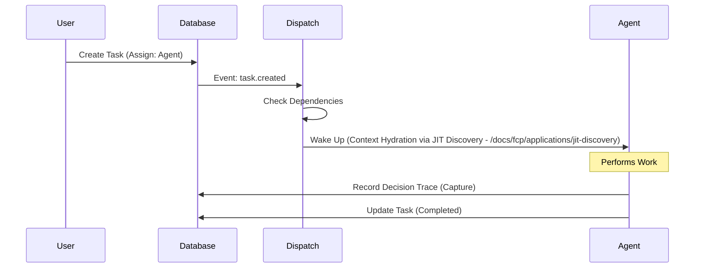

import { Callout } from 'fumadocs-ui/components/callout';
import { InlineTOC } from 'fumadocs-ui/components/inline-toc';
import { File, Folder, Files } from 'fumadocs-ui/components/files';

**Task Dispatch** is the event-driven core that turns passive database rows into active agent instructions. It solves the "Silent Database" problem.

<Callout type="info">
  **Status**: Core Infrastructure (Production)
</Callout>

<InlineTOC items={toc} />

## The Problem

In traditional project management tools:
1.  You create a task.
2.  It sits in a database.
3.  **Nothing happens**.

The database is "silent". Humans have to constantly check dashboards to see if work is ready.

## The Solution

Fide Inverts Control. The database is **active**. When a task's state changes (e.g., created, unblocked), the Dispatch System evaluates rules and wakes up the assigned agent.

## Directory Structure

<Files>
  <Folder name="lib/dispatch" defaultOpen>
    <File name="rules.ts" />
    <File name="trigger.ts" />
  </Folder>
  <Folder name="inngest/functions">
    <File name="on-task-created.ts" />
    <File name="on-dependency-resolved.ts" />
  </Folder>
</Files>

## Implementation Details

### Dispatch Rules

The engine evaluates these conditions before waking an agent:

1.  **Immediate Dispatch**: Task has assignee + No blocking dependencies.
2.  **Delayed Dispatch**: Task has blocking dependencies that are incomplete. (Waits).
3.  **Cascading Dispatch**: When a dependency completes, downstream tasks are re-evaluated and triggered.

### Wake-Up Mechanism

This is implemented using [Inngest](https://www.inngest.com/) for reliable event choreography. During the wake-up phase, the agent uses [JIT Discovery](/docs/fcp/applications/jit-discovery) to pull the most relevant context for the task, ensuring it doesn't hallucinate based on stale or irrelevant data.

## Guarantees & Constraints

*   **Reliability**: At-least-once delivery. Agents *will* be woken up.
*   **Order**: FIFO processing for tasks assigned to the same agent (unless parallel execution is enabled).
*   **Anti-Loop**: Recursion depth limits prevent infinite task-creation loops.

## References

*   [Inngest Documentation](https://www.inngest.com/docs)
*   [Fide Tasks Guide](/docs/workspace/work-management/tasks)
