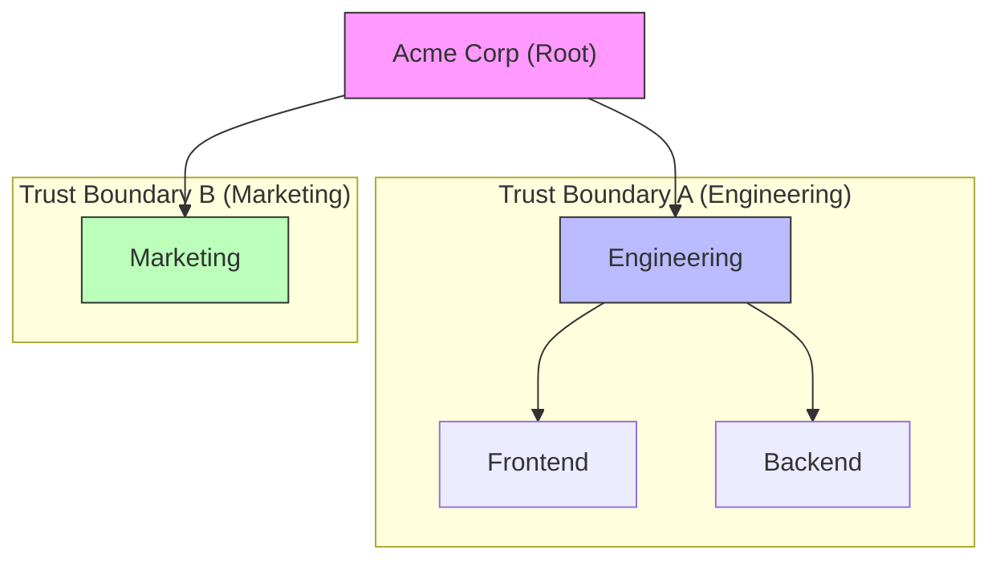

import { Callout } from 'fumadocs-ui/components/callout';
import { InlineTOC } from 'fumadocs-ui/components/inline-toc';
import { Cards } from 'fumadocs-ui/components/card';
import { Accordion, Accordions } from 'fumadocs-ui/components/accordion';
import { SmartDocsCard } from '@/components/mdx/smart-docs-card';

Your team's data stays in your team. Agents can only see what you can see. Private messages stay private.

## How It Works

Teams in Fide form a hierarchy (a tree). This tree defines trust boundaries:

- **Within your team tree:** Members can access resources in their team and sub-teams
- **Across different trees:** Complete isolation—no data flows between separate trees

This isn't just a policy—it's enforced at the database level, so even if there's a bug in the application, your data stays secure.

<InlineTOC items={toc} />

## The Problem

Connecting autonomous agents to your business data creates two major risks:
1.  **Context Leakage:** A "smart" agent might retrieve sensitive HR documents to answer a coding question if the RAG system is flat.
2.  **Permission Drift:** As agents are added, managing execution permissions via role-based lists becomes impossible to audit.

We needed a way to let agents "know everything" about their job without knowing *anything* about secrets they shouldn't see.

## The Solution

Fide fuses **Organization Structure** with **Trust Boundaries**. Instead of maintaining a separate Access Control List (ACL), the shape of your team *is* your security model.

### Tree = Trust Boundary

Every Team in Fide acts as a secure container. This container forms a **Trust Boundary** that dictates what humans and agents can see.

**The 3 Rules of Trust:**
1.  **Downward Visibility**: Context flows down. (e.g., *Engineering* can see *Frontend* tasks).
2.  **Strict Isolation**: Sibling trees are invisible to each other. (e.g., *Marketing* cannot see *Engineering* context).
3.  **Private by Default**: Direct messages are visible **only** to participants, regardless of hierarchy.

<Accordions>
<Accordion title="Technical Details: Database-Level Enforcement (RLS)">

We don't rely on application logic (which can be buggy) to enforce these rules. Fide uses **PostgreSQL Row-Level Security (RLS)**.

*   **Zero Leakage**: Even if an API bug occurs, the database will refuse to return data outside your trust boundary.
*   **Agent Safety**: [Agents](/docs/workspace/fide-agents) operate with the same RLS constraints as humans. They literally *cannot* hallucinate data they don't have access to.

</Accordion>
</Accordions>

### Agent-Specific Permissions

Agents are powerful, but they operate under a **Principle of Least Privilege**:

| Permission Scope | What it Means |
|:---|:---|
| **Team Scope** | Agents can only execute tools within their assigned team. |
| **Tool Whitelisting** | Agents only have access to specific [Tool Packs](/docs/developers/tools) explicitly enabled for their team. |
| **A2A Protocol** | Agents can only delegate tasks to other agents within their visible trust boundary. |

## Architecture Visualization

The hierarchy defines the data flow. Root teams isolate entire organizations or projects.

<Callout type="warn">
  **Marketing** cannot see **Engineering** data. The separation provides a hard guarantee of privacy between departments or different companies hosted on the same instance.
</Callout>

## Data Privacy

Your data protects your competitive advantage.

*   **No Training**: Fide does not train global models on your private team data.
*   **Encryption**: Data is encrypted at rest (AES-256) and in transit (TLS 1.3).
*   **Audit Logs**: Every agent action, tool call, and memory retrieval is logged for full accountability.

## Related

<Cards>
  <SmartDocsCard href="/docs/workspace/teams" />
  <SmartDocsCard href="/docs/workspace/security-and-trust" />
</Cards>
