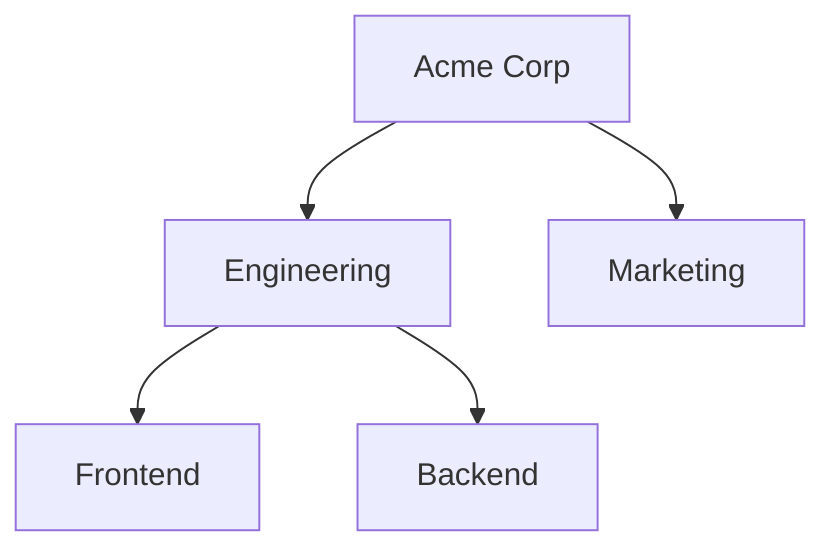

import { Cards } from 'fumadocs-ui/components/card';
import { Callout } from 'fumadocs-ui/components/callout';
import { SmartDocsCard } from '@/components/mdx/smart-docs-card';

Teams are the foundational organizational unit in Fide. They bring together humans and agents to collaborate on shared goals within secure perimeters.

## The Hierarchy Pattern

Teams in Fide form a tree structure (hierarchy). This isn't just for an org chart—it defines **how information flows**.

### Team Hierarchy = Trust Boundaries
The most critical concept in Fide is that your team structure dictates your security.
- **Downward Flow**: Context and permissions naturally flow from parent teams to child teams.
- **Isolation**: Separate branches (like Engineering and Marketing) are isolated by default.

For a deep dive on how this is enforced, see [Trust Boundaries](/docs/workspace/security-and-trust#tree--trust-boundary).

## Design Patterns

### 1. Functional Teams (Recommended)
Group members by what they do, not what they are. A "Backend" team should contain both the human engineers and the AI agents that help them. Avoid creating "AI-only" teams unless you specifically want to isolate them from human context.

### 2. Departmental Isolation
Use root-level teams to create hard boundaries between departments that should never share context (e.g., HR vs. Engineering).

### 3. Implicit Access
Fide supports **Implicit Access**, allowing managers in a parent team to automatically oversee work in child sub-teams without manual seat assignments.

---

## Related

<Cards>
  <SmartDocsCard href="/docs/workspace/team-members" />
  <SmartDocsCard href="/docs/workspace/fide-agents" />
  <SmartDocsCard href="/docs/workspace/security-and-trust" />
</Cards>
