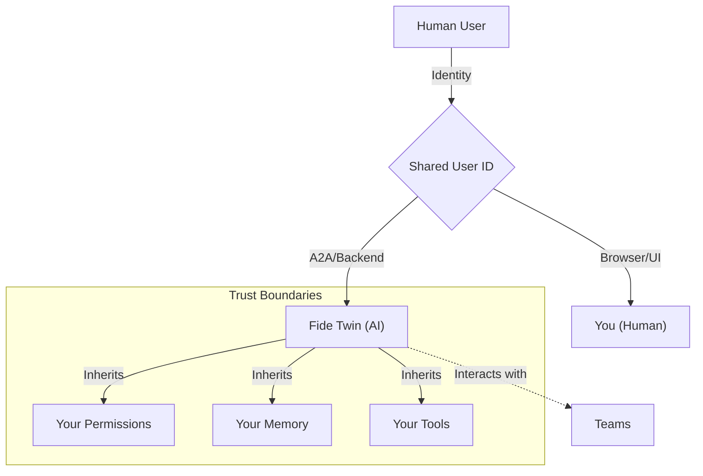

import { Callout } from 'fumadocs-ui/components/callout';
import { Cards } from 'fumadocs-ui/components/card';
import { SmartDocsCard } from '@/components/mdx/smart-docs-card';

**All human Users in Fide have a Fide Twin.** 

The Twin is a special type of [Fide Agent](/docs/workspace/fide-agents) that acts as your AI delegate. It is an always-on AI version of you that shares your permissions, context, and team memberships.

<Callout type="info" title="Core Insight">
  **Delegate, Not Assistant:** An assistant waits for commands. A delegate acts **as you**. Your Fide Twin doesn't just help you work; it *is* you in the digital space when you are not there.
</Callout>

## Shared Identity

Your Fide Twin solves the "Blank Slate" problem of traditional AI by **sharing your identity**. Technically, it uses your exact `User ID`. This means:

*   **Immediate Access:** It has all your permissions and tool capabilities out of the box.
*   **Deep Context:** It can read your past conversations and team memory across all your [Teams](/docs/workspace/teams).
*   **Ubiquity**: Wherever you are a member, your Twin is also a member.

### Assistant vs. Delegate

| Aspect | Assistant (Copilot, ChatGPT) | Delegate (Fide Twin) |
|--------|------------------------------|----------------------|
| **Identity** | Separate entity | IS you (same user ID) |
| **Permissions** | Limited, sandboxed | Your full permissions |
| **Context** | Starts fresh each session | Your complete history |
| **Start State** | "How can I help?" | "I already know your context" |

## Operational Modes

Your Fide Twin adapts its behavior based on how it is invoked.

### Internal Mode (Interactive)
**Trigger:** You messaging your Twin directly via the Fide UI or Telegram.
*   **Scope:** Focused on the current Team tree (current team + descendants).
*   **Capabilities:** Can switch team contexts dynamically.
*   **Goal:** Help *you* navigate and execute work in real-time.

### External Mode (Autonomous)
**Trigger:** Another agent or team member calling your Twin via [A2A Protocol](/docs/developers/a2a-protocol).
*   **Scope:** Accesses the specific team context requested by the caller.
*   **Capabilities:** Locked to the assigned task; cannot switch teams autonomously.
*   **Goal:** Represent you in asynchronous workflows (e.g., answering a question for a colleague while you are away).

## Architecture Visualization

---

## Related

<Cards>
  <SmartDocsCard href="/docs/workspace/workspace-users" />
  <SmartDocsCard href="/docs/workspace/fide-agents" />
</Cards>
